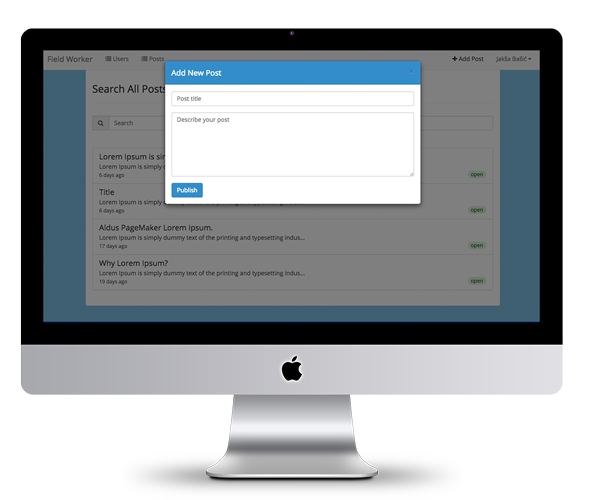

##[Field Worker](https://fieldworker0.firebaseapp.com) (demo)

- Html5, Css3, Sass, Compass
- Bootstrap
- Angularjs
- Firebase
- Google Maps Api
- Bower
- Grunt

##Instructions
#####Clone Repo

```
git clone https://github.com/jaksa-b/FieldWorker.git
cd FieldWorker
```
#####Install Dependencies

```
npm install && bower install
```
#####Run Grunt Server 

```
grunt serve
```
##Config

Change Firebase url in App.js:

```
/* Set your own Firebase url */
.constant('FURL', 'https://fieldworker0.firebaseio.com/')

```

##License
MIT

